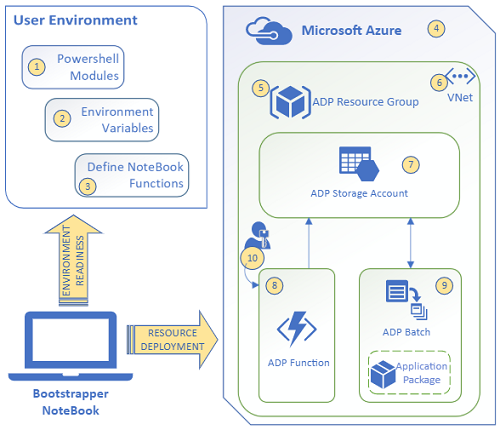

# Data Portability 
[Home](../readme.md)

Notebooks in this chapter perform a data migration using a custom Azure function that can be deployed to an Azure subscription. It enables [Azure Batch](https://azure.microsoft.com/en-us/services/batch) computing of a complex SQL Server migration to and from a single Resource Group. Azure Batch is a process that runs large-scale parallel and high-performance computing (HPC) batch jobs efficiently in Azure. This greatly reduces the processing required locally which should prevent long execution times, timeouts and retries. Importing and exporting data to and from Azure is supported for multiple SQL database instances. Data is imported and exported to and from standard SQL backup formats (*.bacpac) which "encapsulates the database schema as well as the data stored in the database" ([Microsoft Docs](https://docs.microsoft.com/en-us/sql/relational-databases/data-tier-applications/data-tier-applications)).

## Notebooks in this Chapter

- [Azure Data Portability Setup](setup-adp.ipynb) - Configure and install a custom Azure function to migrate data to and from Azure  

- [Export Sql Server](export-sql-server.ipynb) - from SQL Azure to a standard SQL backup format

- [Import Sql Server](import-sql-server.ipynb) - from SQL backup format to Azure

## Steps 
1. The Azure function must first be deployed using the setup notebook
2. Open the notebook for the desired migration path (import or export)
3. Configure and execute notebook
4. Monitor progress with periodic notebook queries
5. Verify data has been imported/exported by reviewing the storage account for the migrated Resource Group
