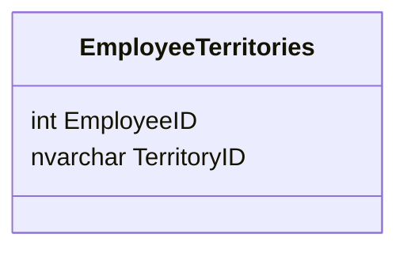

m
### EmployeeTerritories
**Overview**
The EmployeeTerritories table stores the relationship between employees and territories. It indicates which territories are assigned to each employee.

**Fields**
• EmployeeID: This field is of type integer and represents the unique identifier of an employee. It is a foreign key referencing the EmployeeID field in the Employees table.
• TerritoryID: This field is of type nvarchar(20) and represents the unique identifier of a territory. It is a foreign key referencing the TerritoryID field in the Territories table.

**Relationships**
The EmployeeTerritories table has a one-to-many relationship with the Employees table, where each record in the EmployeeTerritories table corresponds to one employee. The EmployeeID field in the EmployeeTerritories table references the EmployeeID field in the Employees table.

The EmployeeTerritories table also has a one-to-many relationship with the Territories table, where each record in the EmployeeTerritories table corresponds to one territory. The TerritoryID field in the EmployeeTerritories table references the TerritoryID field in the Territories table.
