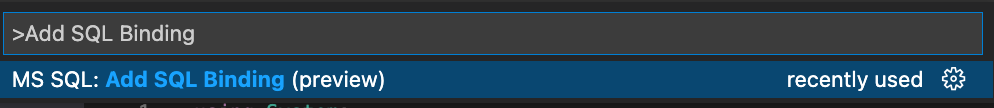
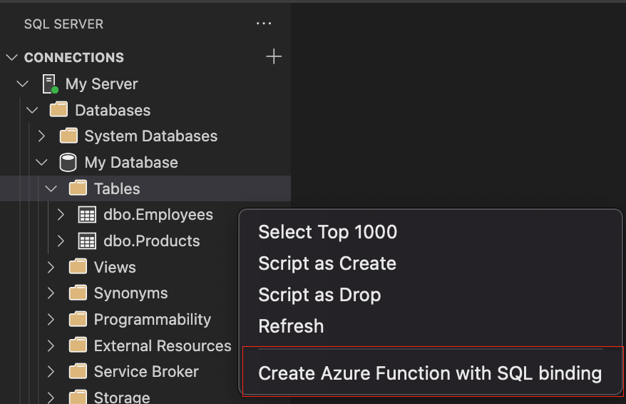
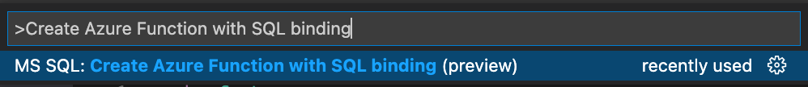

# Microsoft SQL Bindings for VS Code

## Overview

Microsoft SQL Bindings for VS Code enables users to develop Azure Functions with Azure SQL bindings

### VS Code

This extension is bundled into the `SQL Server (MSSQL)` extension for VS Code and will be installed automatically when that extension is updated or installed.

## Getting Started with SQL Bindings

### While the Azure Function project file is open search the command palette for `Add SQL Binding` to add a SQL binding to the Azure Function project:

### Create an Azure Function with SQL Binding through the below options:

* To create an Azure Function project from a specific table, choose a specific SQL Connection table via the object explorer and right click on the table and select **Create Azure Function with SQL Binding**.

* Create an Azure Function Project with SQL binding by searching the command palette for `Create Azure Function with SQL Binding` via the command palette.

## Code of Conduct

This project has adopted the [Microsoft Open Source Code of Conduct](https://opensource.microsoft.com/codeofconduct/). For more information see the [Code of Conduct FAQ](https://opensource.microsoft.com/codeofconduct/faq/) or contact [opencode@microsoft.com](mailto:opencode@microsoft.com) with any additional questions or comments.

## Privacy Statement

The [Microsoft Enterprise and Developer Privacy Statement](https://privacy.microsoft.com/privacystatement) describes the privacy statement of this software.

## License

Copyright (c) Microsoft Corporation. All rights reserved.

Licensed under the [Source EULA](https://raw.githubusercontent.com/Microsoft/azuredatastudio/main/LICENSE.txt).
