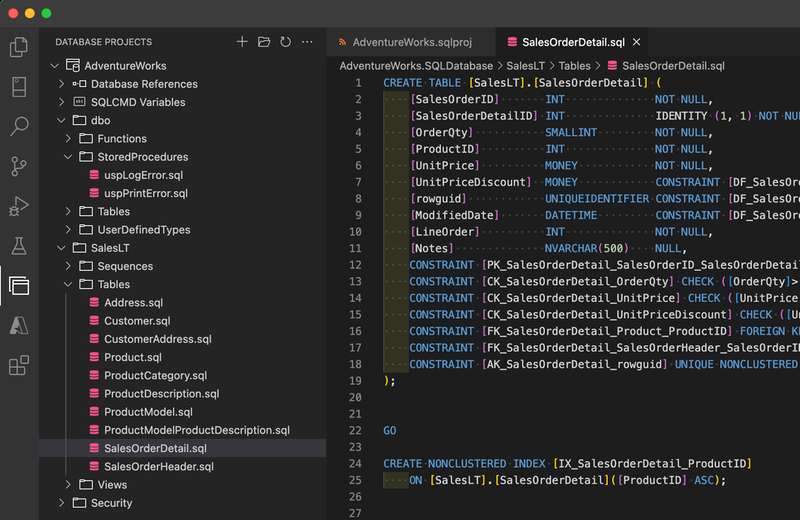

# SQL Database Projects for Azure Data Studio and VS Code

## Overview

SQL Database Projects for Azure Data Studio and VS Code provides a way to design, edit, and publish schemas for SQL databases from a source controlled project.

Learn more in the documentation: https://aka.ms/azuredatastudio-sqlprojects

## Features

- Develop database objects using T-SQL
- Store the database schema in source control
- Validate object relationships with project build
- Publish the database objects to a SQL Server or Azure SQL instance
- Publish the database objects to a local development container
- Update the database project from a database

### Preview Features

- Microsoft.Build.Sql SDK-style projects
- Generate SQL projects from OpenAPI/Swagger specs

## Getting Started with Database Projects

* Create a new database project by going to the `Database Projects` view or by searching `Database Projects: New` in the command palette.
* Existing database projects can be opened by going to the `Database Projects` view or by searching `Database Projects: Open existing` in the command palette.
* Start from an existing database by using the `Create Project from Database` from the command palette or database context menu.
* Start from an OpenAPI/Swagger spec by using the `Generate SQL Project from OpenAPI/Swagger spec` command (Preview).

## Settings

### General Settings
- `sqlDatabaseProjects.dotnetSDK Location`: The path to the dotnet SDK. If not set, the extension will attempt to find the dotnet SDK on the system.
- `sqlDatabaseProjects.microsoftBuildSqlVersion`: Version of Microsoft.Build.Sql to use for SDK-style SQL projects. If not set, the extension will use 0.1.9-preview.
- `sqlDatabaseProjects.netCoreDoNotAsk`: Override option to not ask to install .NET Core SDK when a supported installation is not found.
- `sqlDatabaseProjects.collapseProjectNodes`: Option to set the default state of the project nodes in the database projects view to collapsed. If not set, the extension will default to expanded.

### Autorest Settings (preview)

- `sqlDatabaseProjects.nodejsDoNotAsk`: Override option to not ask to install Node.js when a supported installation is not found.
- `sqlDatabaseProjects.autorestSqlVersion`: Version of autorest.sql to use for generating SQL projects from OpenAPI/Swagger specs. If not set, the extension will use the latest version.

## Code of Conduct

This project has adopted the [Microsoft Open Source Code of Conduct](https://opensource.microsoft.com/codeofconduct/). For more information see the [Code of Conduct FAQ](https://opensource.microsoft.com/codeofconduct/faq/) or contact [opencode@microsoft.com](mailto:opencode@microsoft.com) with any additional questions or comments.

## Telemetry

This extensions collects telemetry data, which is used to help understand how to improve the product. For example, this usage data helps to debug issues, such as slow start-up times, and to prioritize new features. While we appreciate the insights this data provides, we also know that not everyone wants to send usage data and you can disable telemetry as described [here for Azure Data Studio](https://aka.ms/ads-disable-telemetry) or [here for VS Code](https://code.visualstudio.com/docs/getstarted/telemetry#_disable-telemetry-reporting).

## Privacy Statement

To learn more about our Privacy Statement visit [this link](https://go.microsoft.com/fwlink/?LinkID=824704).

## Feedback

Please report issues and feature requests [here.](https://github.com/microsoft/azuredatastudio/issues)

## License

Copyright (c) Microsoft Corporation. All rights reserved.

Licensed under the [Source EULA](https://raw.githubusercontent.com/Microsoft/azuredatastudio/main/LICENSE.txt).
